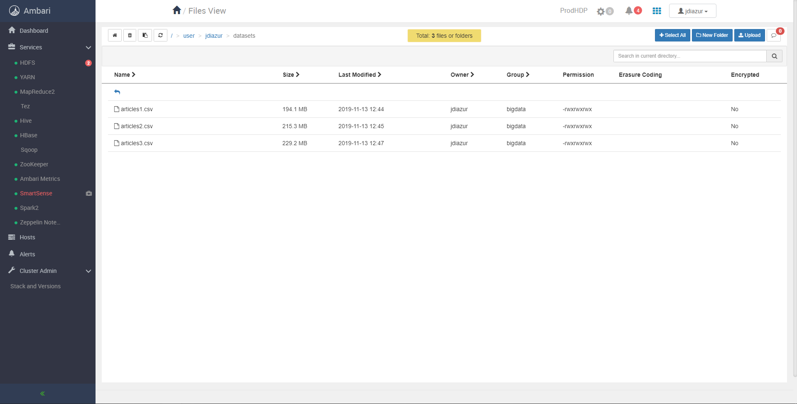

# Universidad EAFIT
# Curso ST0263 Tópicos Especiales en Telemática, 2019-2
# Profesor: Alvaro Ospina - aeospinas@eafit.edu.co
# Por José Alejandro Diaz Urrego
## 1. Datasets en el ambari
## 
## 2. Preparacion en el jupyter y llamado de librerias
## 
## 3. Se cargan los datasets
## 
## 4. Se hace la limpieza de los datasets
## 
## 
## 5. Se tokenizan los datos en el dataset
## 
## 6. Se corre el StopWordsRemover después de tenerlo tokenizado
## 
## 7. Stemming y lemmatization
## 
## 
